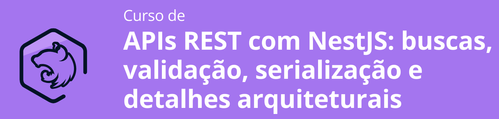

# NestJS (Primeiras Impressões)

O Objetivo deste curso é desenvolver uma API rest com buscas, validações e detalhes arquiteturais.



## Definindo domínio de Usuarios

1. Inicializando nosso projeto
  ```
  nest new produtos-api
  ```
2. Separando nosso projeto por domínios (Criando a pasta `src/usuario`)

3. Criando o controller src/usuario/usuario.controller.ts

4. Criando o Metodo CRIAR (POST) src/usuario/usuario.controller.ts

5. Criando o Service src/usuario/usuario.service.ts

6. Testando as rotas api.http

## Organização do projeto e injeção de dependências

1. 

## Validação de dados

1. 

## Serialização e tratamento de erros

1. 

## Aplicando os padrões REST

1. 